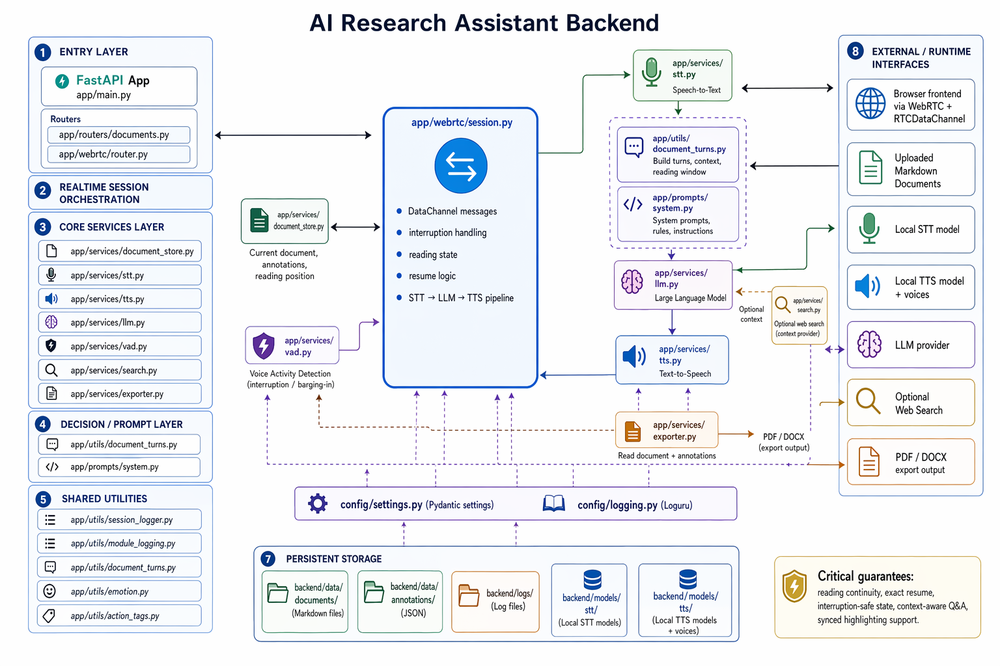

# NeuroTalk

> Read aloud. Ask anything. Remember everything.

A voice-powered AI reading companion built around a customer-facing voice UI: upload a document, have the agent read stored content aloud with live word highlighting, ask questions mid-reading, save annotated snippets, switch voices and speech speed, and export the annotated document as PDF or DOCX — all over a real-time WebRTC voice pipeline.

## Demo

https://github.com/nitishkmr005/neuroTalk/raw/main/docs/NeuroTalk_Social_Media_V3.mp4

In the preview above, `Response Generation: 14.16 s` reflects the time the LLM spends generating the reply token by token in real time.
Because text streaming and voice streaming are synchronized, TTS starts speaking as tokens arrive, so playback overlaps with generation instead of waiting for the full response.

## Highlights

- Premium voice-first UI with an immersive orb, live transcript, voice settings, and full-screen reading mode.
- Upload `.md` documents and have the agent read stored document text aloud with real-time word-level highlighting.
- Reading mode expands the document workspace to full width for focused document playback and annotation.
- The explicit document action starts reading from the beginning; resume remains available through saved session state.
- Ask questions mid-reading — agent answers from recent document context first, or triggers a live web search when needed.
- Save snippets (term + explanation) as persistent annotations on any sentence.
- Manually highlight sentences; all highlights, snippets, and reading position survive session restarts.
- Switch voices with preview playback and adjust speech speed from voice settings.
- Export annotated documents as PDF (yellow-highlighted sentences, callout notes) or DOCX.
- `WebRTC` is the default live transport, with `WebSocket` kept as a fallback/debug path.
- Persistent multi-turn sessions keep conversation history in the same live voice call.
- Sentence-streaming TTS starts playback before the full LLM response finishes.
- Real-time barge-in stops playback when the user speaks over the assistant.
- Dedicated streaming `Silero VAD` improves speech start/end detection, endpointing, and barge-in timing.

## Product Experience

NeuroTalk now has two primary workspace modes:

- `Conversation`: the immersive orb is the main interaction, with the live transcript below and document context alongside it.
- `Reading`: the selected document expands into a full-screen reading workspace with live reading state and synced highlighting.

The top bar keeps the core controls always available:

- workspace toggle: `Conversation` / `Reading`
- live session state
- private session marker
- voice settings with preview playback and speech speed
- dark/light theme toggle

## Stack

| Layer | Tech |
|-------|------|
| Frontend | Next.js 15 · TypeScript · immersive voice UI · dark/light themes |
| Backend | FastAPI · Python 3.11+ · uv |
| Transport (audio in) | **WebRTC / RTP** (Opus codec, `aiortc` + `PyAV`) · WebSocket PCM streaming |
| Transport (agent out) | **RTCDataChannel** (ordered JSON) · WebSocket JSON |
| STT | faster-whisper (`small`, int8, CPU) — via CTranslate2 |
| LLM | Ollama (local) — `llama3.2:3b` (default) |
| TTS | Kokoro 82M MLX (default) · Chatterbox Turbo · Qwen · VibeVoice · voice preview · speech speed control |
| Documents | Markdown upload · sentence-level annotation · JSON persistence |
| Web search | DuckDuckGo (async, 5 s timeout) |
| Export | reportlab (PDF) · python-docx (DOCX) |
| Server-side VAD | `Silero VAD` for streaming endpointing/barge-in · RMS fallback when disabled |
| ICE / NAT traversal | STUN (`stun.l.google.com:19302`) · Vanilla ICE (full gather before offer) |
| Config | Pydantic Settings + `.env` |
| Logging | Loguru — colorful terminal + rotating JSON files |

## Quick Start

```bash
# 1. Install system dependency (macOS — required by aiortc for SRTP)
brew install libsrtp

# 2. Install project dependencies
make setup

# 3. Set up Ollama (LLM — local, no API key)
brew install ollama
ollama pull llama3.2:3b
ollama serve          # runs at http://localhost:11434

# 4. Run both services
make dev
# Frontend → http://localhost:3000
# Backend  → http://localhost:8000
```

> **Linux:** replace `brew install libsrtp` with `apt-get install libsrtp2-dev` (Debian/Ubuntu).

## Transport

NeuroTalk uses WebRTC as the customer-facing live voice transport:

| Mode | Audio path | Signalling |
|------|-----------|------------|
| **WebRTC** (default) | Browser mic → Opus RTP → UDP → aiortc → PCM 16kHz | RTCDataChannel (JSON) |

WebRTC is recommended because browser-native echo cancellation, noise suppression, and auto-gain control are applied before encoding. WebSocket remains in the codebase as an internal fallback/debug path, but the UI presents WebRTC only.

The WebRTC path keeps a long-lived peer connection open so follow-up turns reuse the same session instead of reconnecting every request.

## Reading Semantics

The reading flow intentionally separates explicit UI actions from conversational resume behavior:

- `Read aloud` from the document workspace starts the selected document from the beginning.
- conversational commands such as `continue`, `resume`, or `keep reading` continue from the saved reading position.
- during playback, the backend streams stored document sentences in order and emits word ticks so the UI can highlight the current spoken word.
- interruptions preserve reading state, which allows Q&A without losing the document position.

## Backend Runtime Design

This section is backend-only. It explains how the server moves audio, document state, and control events through the system.

### Backend Repository Architecture



The backend flow is easier to read as a staged pipeline:

1. The browser sends either microphone audio or a UI control action into the FastAPI entrypoint.
2. The entrypoint routes the request into the active transport:
   `WebRTC` by default, `WebSocket` as fallback/debug.
3. Incoming audio passes through streaming VAD, then into the STT service.
4. The turn orchestrator classifies the intent:
   `Q&A`, `Read document`, `Resume/Pause`, or `Highlight/Note/Export`.
5. Intent routing fans out to the right backend subsystem:
   the `LLM service`, `Document store`, `Reading state machine`, or `Annotation + export services`.
6. Anything that must be spoken goes through the `TTS service`.
7. The backend emits typed events back to the client:
   `tts_audio`, `tts_done`, `tts_interrupted`, `doc_read_start`, `doc_highlight`, `reading_position`, `doc_note_saved`, `doc_highlight_saved`, and `doc_export`.
8. Those events are delivered over `RTCDataChannel` in the WebRTC path or JSON over `WebSocket` in fallback mode.

### Backend Q&A Flow

| Step | From | To | What moves |
|------|------|----|------------|
| 1 | User audio | Session | PCM / RTP frames |
| 2 | Session | VAD | streaming audio frames |
| 3 | VAD | Session | speech start / speech end markers |
| 4 | Session | Whisper STT | buffered speech segment |
| 5 | Whisper STT | Session | transcript |
| 6 | Session | LLM | transcript + conversation history + recent document context |
| 7 | LLM | Session | structured decision + response text |
| 8 | Session | TTS | response text |
| 9 | TTS | Session | sentence audio chunks |
| 10 | Session | Client | `llm_start`, `llm_partial`, `llm_final` |
| 11 | Session | Client | `tts_start`, `tts_audio`, `tts_done` |

In short: audio becomes transcript, transcript becomes a grounded answer, and the answer is streamed back as both text events and audio events.

### Backend Document Reading Flow

| Step | From | To | What happens |
|------|------|----|--------------|
| 1 | UI | Session | `doc_read` or `continue_reading` |
| 2 | Session | Document store | load selected document |
| 3 | Document store | Session | ordered sentences + saved `reading_position` |
| 4 | Session | Client UI | `doc_read_start` |
| 5 | Session | TTS | synthesize the next stored sentence only |
| 6 | Session | Document store | persist `reading_position(sentence_idx)` |
| 7 | Session | Client UI | `doc_highlight(sentence_idx)` |
| 8 | TTS | Session | wav bytes |
| 9 | Session | Client UI | `tts_audio(sentence_idx, sentence_text)` |

The loop above repeats sentence by sentence until one of these terminal states happens:

| End condition | Backend result |
|--------------|----------------|
| User pauses | session emits `doc_reading_pause` and keeps the saved sentence index |
| Reading completes | session emits `tts_done` |

### Backend Control-State Model

The backend keeps reading continuity through a small set of authoritative session variables:

| State | Purpose |
|------|---------|
| `active_document_id` / `_active_document_id` | Current selected document for reading and Q&A |
| `last_read_sentence_idx` / `_last_read_sentence_idx` | Most recently emitted sentence index |
| `resume_from_sentence_idx` / `_resume_from_sentence_idx` | Resume cursor after pause/interruption |
| `interrupt_event` / `_interrupt_event` | Immediate stop signal for active TTS / read flow |
| `llm_task` / `_llm_task` | Running orchestration task |
| `tts_task` / `_tts_task` | Running synthesis / streaming task |

This is the core rule behind pause/resume:

1. `pause_reading` stops active TTS immediately.
2. The session keeps the saved sentence index.
3. `continue_reading` restarts the document reader from that saved index.
4. The backend emits the same sentence index back to the client in `tts_audio` and `doc_highlight`.

### Backend Event Contract For Animation

The frontend animation is not authoritative. It follows backend events. These are the events that drive the visible state:

| Backend event | Meaning | Expected UI animation/state |
|--------------|---------|-----------------------------|
| `ready` | transport/session is usable | idle orb / ready controls |
| `partial` | live STT still in progress | listening waveform |
| `final` | user turn finalized | thinking transition |
| `llm_start` | assistant turn opened | transcript assistant bubble appears |
| `llm_partial` | assistant text is forming | responding state |
| `tts_start` | playback started | speaking orb / waveform activation |
| `tts_audio` | ordered sentence audio chunk | sentence reveal + word highlight scheduler |
| `doc_read_start` | document reading session started | reading workspace enters active mode |
| `doc_highlight` | backend advanced to a specific sentence | current sentence card/line updates |
| `doc_reading_resume` | resume accepted by backend | reading state resumes without reset |
| `doc_reading_pause` | pause accepted by backend | playback animation stops, state preserved |
| `tts_interrupted` | playback was cut off | orb collapses back to listening |
| `tts_done` | playback completed | speaking animation ends cleanly |

### Animation Design Notes From The Backend Contract

These are design rules implied by the backend event stream:

- `tts_audio` order must be preserved. If chunk order changes, spoken text, transcript reveal, and word highlight drift apart.
- `doc_highlight` and `tts_audio.sentence_idx` must refer to the same sentence sequence from the stored document, not a regenerated paraphrase.
- `pause_reading` must never clear reading position; it only stops active synthesis.
- `continue_reading` must clear the interrupt flag before restarting TTS.
- document reading uses stored-content playback with barge-in disabled, otherwise ambient mic input can cancel reading mid-sentence.
- the UI should animate only from backend truth, not from speculative client timers beyond per-chunk word highlighting.

### Why The Reading Flow Is Stable

The backend preserves correctness by separating responsibilities:

- the document store owns ordered source sentences
- the session owns current reading position
- the LLM decides only Q&A and action routing
- the TTS service speaks the exact stored sentence text
- the client animates from backend sentence indices and audio chunk order

That separation is what keeps:

- resume exact
- pause immediate
- interruption reversible
- and highlighting aligned to spoken stored text

## Environment Variables

Copy `backend/.env.example` → `backend/.env` and adjust as needed.

| Variable | Default | Description |
|----------|---------|-------------|
| `STT_MODEL_SIZE` | `small` | Whisper model (`tiny.en` → `large-v3`) |
| `STT_MODEL_PATH` | `models/stt` | Local faster-whisper model directory used instead of downloading from Hugging Face |
| `STT_DEVICE` | `cpu` | `cpu` or `cuda` |
| `OLLAMA_HOST` | `http://localhost:11434` | Ollama server URL |
| `LLM_MODEL` | `llama3.2:3b` | Any model pulled via `ollama pull` |
| `LLM_MAX_TOKENS` | `100` | Max tokens per LLM response |
| `LLM_MAX_HISTORY_TURNS` | `6` | Conversation turns kept in context |
| `TTS_BACKEND` | `kokoro` | TTS engine — see below |
| `TTS_MODEL_PATH` | `models/tts` | Local Kokoro model directory and voices used instead of downloading from Hugging Face |
| `STREAM_EMIT_INTERVAL_MS` | `250` | Minimum gap between partial STT emits |
| `STREAM_MIN_AUDIO_MS` | `300` | Minimum buffered audio before STT runs |
| `STREAM_LLM_MIN_CHARS` | `8` | Minimum transcript length before starting the LLM |
| `STREAM_LLM_SILENCE_MS` | `950` | Debounce fallback when VAD end does not fire cleanly |
| `STREAM_VAD_ENABLED` | `true` | Enable dedicated streaming voice activity detection |
| `STREAM_VAD_THRESHOLD` | `0.4` | Speech probability threshold for VAD start detection |
| `STREAM_VAD_MIN_SILENCE_MS` | `600` | Required silence before VAD emits speech end |
| `STREAM_VAD_SPEECH_PAD_MS` | `200` | Extra speech padding kept around VAD boundaries |
| `STREAM_VAD_FRAME_SAMPLES` | `512` | Frame size fed into the streaming VAD at 16 kHz |
| `WELCOME_MESSAGE` | `Hello! I'm your NeuroTalk voice assistant...` | Spoken greeting streamed on session start; empty disables it |

## Switching LLM Models

NeuroTalk uses Ollama for local LLM inference. Switching models is one line.

**Available models (fast → quality):**

| Model | `LLM_MODEL` value | Notes |
|-------|-------------------|-------|
| Llama 3.2 3B | `llama3.2:3b` | **Default.** Fast, low RAM (~2 GB). |
| Qwen3 4B | `qwen3:4b` | Fast, strong tool-calling (~3 GB). |
| Gemma 3 1B | `gemma3:1b` | Fastest, minimal memory (~1 GB). |
| Gemma 3 4B | `gemma3:4b` | Better quality (~3 GB RAM). |
| Llama 3.2 1B | `llama3.2:1b` | Similar speed to gemma3:1b. |
| Mistral 7B | `mistral` | Strong general model. |

```bash
# 1. Pull the model
ollama pull qwen3:4b

# 2. Set in backend/.env
LLM_MODEL=qwen3:4b

# 3. Restart backend
make backend
```

One-liner (no .env edit):
```bash
LLM_MODEL=qwen3:4b make backend
```

> To use a non-Ollama provider (OpenAI, Anthropic, etc.), update `backend/app/services/llm.py` to call the respective SDK instead of the Ollama client.

---

## Switching STT Models

NeuroTalk uses `faster-whisper` for speech recognition.

**Whisper model sizes:**

| `STT_MODEL_SIZE` | Speed | Accuracy | RAM |
|------------------|-------|----------|-----|
| `tiny.en` | ~4× faster | Lower | ~200 MB |
| `small.en` | **Default** | Good | ~500 MB |
| `medium.en` | Slower | Better | ~1.5 GB |
| `large-v3` | Slowest | Best | ~3 GB |

```bash
# Set in backend/.env
STT_MODEL_SIZE=tiny.en   # for speed
STT_MODEL_SIZE=large-v3  # for accuracy

make backend
```

**Using Google Speech Recognition (or other providers):**
Replace `backend/app/services/stt.py` with a client for the desired provider. The service must implement `transcribe(*, file_path, request_id, filename, audio_bytes) -> ServiceResult`. All other code stays the same.

---

## Switching TTS Models

Four TTS engines are available. Only one is installed at a time.

| Backend | Value | Notes |
|---------|-------|-------|
| Kokoro 82M MLX | `kokoro` | **Default.** Fast, natural. Apple Silicon only. |
| Chatterbox Turbo | `chatterbox` | Emotion tag support. Requires PyTorch. |
| Qwen TTS | `qwen` | Requires PyTorch. |
| VibeVoice | `vibevoice` | Requires PyTorch. |

**To switch:**

```bash
# 1. Set the backend in backend/.env
TTS_BACKEND=chatterbox   # or kokoro / qwen / vibevoice

# 2. Reinstall backend deps with the new model group
make backend-install TTS_BACKEND=chatterbox

# 3. Restart the backend
make backend
```

One-liner (no .env change needed):
```bash
make dev TTS_BACKEND=chatterbox
```

> **Note:** `kokoro` uses `mlx-audio` which requires Apple Silicon (macOS). For Linux/cloud deployment, use `chatterbox` or `qwen`.

## Project Structure

```
docent/
├── backend/              # FastAPI backend
│   ├── app/
│   │   ├── main.py       # WebSocket route + app startup/warmup
│   │   ├── webrtc/       # WebRTC transport (NEW)
│   │   │   ├── router.py     # POST /webrtc/offer, DELETE /webrtc/session/{id}
│   │   │   └── session.py    # RTCPeerConnection, RTP consumer, VAD, STT→LLM→TTS
│   │   ├── services/     # STT, LLM, TTS, VAD, document store modules
│   │   ├── prompts/      # System prompts
│   │   ├── utils/        # Shared utilities (emotion tag cleaning, etc.)
│   │   └── models.py     # Pydantic response models
│   ├── config/           # Settings + logging
│   └── logs/             # JSON log files (latest 5 kept)
├── frontend/             # Next.js app
│   └── components/
│       ├── voice-agent-console.tsx   # Main customer-facing shell
│       ├── document-panel.tsx        # Document workspace + reading view
│       ├── voice/
│       │   ├── VoiceOrbHero.tsx      # Immersive voice orb
│       │   └── waveform-utils.ts     # Orb waveform helpers
│       └── webrtc-transport.ts       # RTCPeerConnection + RTCDataChannel client
├── scripts/              # Standalone learnable Python demos
│   ├── stt.py            # STT only
│   ├── llm_call.py       # LLM only
│   ├── tts.py            # TTS only
│   └── agent.py          # Full pipeline
├── docs/
│   └── blog.md           # End-to-end pipeline deep-dive
└── Makefile
```

## Learnable Scripts

Run each module independently to understand how it works:

```bash
# STT — transcribe a WAV file
uv run --project backend python scripts/stt.py path/to/audio.wav

# LLM — stream a response from Ollama
uv run --project backend python scripts/llm_call.py "Reset my password"

# TTS — speak text aloud
uv run --project backend python scripts/tts.py "Hello, how can I help?"

# Full pipeline — audio → transcript → LLM → speech
uv run --project backend python scripts/agent.py path/to/audio.wav
```

## Makefile Commands

| Command | Description |
|---------|-------------|
| `make dev` | Start backend + frontend (with port cleanup) |
| `make backend` | Backend only (hot-reload) |
| `make frontend` | Frontend only |
| `make setup` | Install all dependencies |
| `make check` | Lint + type check |
| `make tts-envs` | Install isolated venvs for all TTS models |
| `make tts-report` | Run all TTS models and save comparison report to `scripts/speech/` |

## Recent UI Additions

- Immersive voice orb with animated radial waveform and mini-wave status bars
- Voice settings modal with:
  - voice carousel
  - preview playback
  - speech speed control
  - playback summary
- Full-screen reading workspace
- Better transcript and library empty states
- Persistent dark/light theme selection
